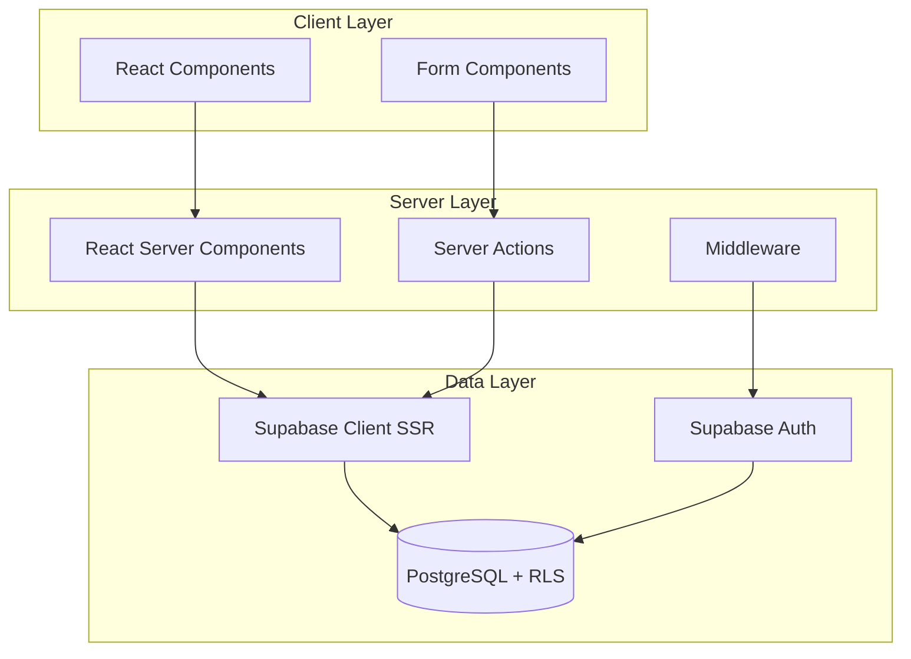

# Design Document: Vibe Notes

## Overview

Vibe Notes is a minimalist note-taking web application built with Next.js 15 (App Router) and Supabase. The application follows a server-first architecture using React Server Components for data fetching and Server Actions for mutations. Security is enforced at the database level through Supabase Row Level Security (RLS).

### Key Design Principles

- **Server Actions First**: All database mutations use Server Actions, avoiding API routes
- **Type Safety**: Strict TypeScript with shared interfaces for data models
- **Security by Default**: RLS policies ensure data isolation at the database level
- **Component Reusability**: Leverage shadcn/ui components for consistent UI

## Architecture



### Request Flow

1. **Authentication**: Middleware intercepts requests, validates session via Supabase Auth
2. **Data Fetching**: RSC fetches data directly using Supabase client
3. **Mutations**: Client components invoke Server Actions for CRUD operations
4. **Security**: RLS policies filter data at database level based on `auth.uid()`

## Components and Interfaces

### Directory Structure

```
src/
├── app/
│   ├── (auth)/
│   │   ├── login/page.tsx
│   │   └── signup/page.tsx
│   ├── (protected)/
│   │   ├── dashboard/page.tsx
│   │   └── notes/[id]/page.tsx
│   ├── layout.tsx
│   └── page.tsx
├── components/
│   ├── ui/                    # shadcn components
│   ├── auth/
│   │   ├── login-form.tsx
│   │   ├── signup-form.tsx
│   │   └── logout-button.tsx
│   └── notes/
│       ├── note-card.tsx
│       ├── note-editor.tsx
│       ├── note-list.tsx
│       └── delete-dialog.tsx
├── lib/
│   ├── supabase/
│   │   ├── client.ts          # Browser client
│   │   ├── server.ts          # Server client
│   │   └── middleware.ts      # Auth middleware helper
│   ├── actions/
│   │   ├── auth.ts            # Auth server actions
│   │   └── notes.ts           # Notes server actions
│   ├── types.ts               # Shared TypeScript types
│   └── validations.ts         # Input validation schemas
└── middleware.ts              # Next.js middleware
```

### Core Interfaces

```typescript
// lib/types.ts

export interface Note {
  id: string;
  user_id: string;
  title: string | null;
  content: string | null;
  created_at: string;
  updated_at: string;
}

export interface NoteInsert {
  title?: string | null;
  content?: string | null;
}

export interface NoteUpdate {
  title?: string | null;
  content?: string | null;
}

export interface ActionResult<T = void> {
  success: boolean;
  data?: T;
  error?: string;
}

export interface AuthCredentials {
  email: string;
  password: string;
}
```

### Server Actions Interface

```typescript
// lib/actions/notes.ts
export async function createNote(): Promise<ActionResult<Note>>;
export async function getNote(id: string): Promise<ActionResult<Note>>;
export async function getNotes(): Promise<ActionResult<Note[]>>;
export async function updateNote(
  id: string,
  data: NoteUpdate
): Promise<ActionResult<Note>>;
export async function deleteNote(id: string): Promise<ActionResult>;

// lib/actions/auth.ts
export async function signUp(
  credentials: AuthCredentials
): Promise<ActionResult>;
export async function signIn(
  credentials: AuthCredentials
): Promise<ActionResult>;
export async function signOut(): Promise<ActionResult>;
```

### Component Props

```typescript
// Note Card
interface NoteCardProps {
  note: Note;
}

// Note Editor
interface NoteEditorProps {
  note: Note;
}

// Note List
interface NoteListProps {
  notes: Note[];
}

// Delete Dialog
interface DeleteDialogProps {
  noteId: string;
  noteTitle: string | null;
  open: boolean;
  onOpenChange: (open: boolean) => void;
}
```

## Data Models

### Database Schema

```sql
-- Notes table
CREATE TABLE notes (
  id UUID PRIMARY KEY DEFAULT gen_random_uuid(),
  user_id UUID REFERENCES auth.users(id) NOT NULL,
  title TEXT,
  content TEXT,
  created_at TIMESTAMPTZ DEFAULT now(),
  updated_at TIMESTAMPTZ DEFAULT now()
);

-- Enable RLS
ALTER TABLE notes ENABLE ROW LEVEL SECURITY;

-- RLS Policies
CREATE POLICY "Users can view own notes"
  ON notes FOR SELECT
  USING (auth.uid() = user_id);

CREATE POLICY "Users can insert own notes"
  ON notes FOR INSERT
  WITH CHECK (auth.uid() = user_id);

CREATE POLICY "Users can update own notes"
  ON notes FOR UPDATE
  USING (auth.uid() = user_id);

CREATE POLICY "Users can delete own notes"
  ON notes FOR DELETE
  USING (auth.uid() = user_id);

-- Updated_at trigger
CREATE OR REPLACE FUNCTION update_updated_at()
RETURNS TRIGGER AS $$
BEGIN
  NEW.updated_at = now();
  RETURN NEW;
END;
$$ LANGUAGE plpgsql;

CREATE TRIGGER notes_updated_at
  BEFORE UPDATE ON notes
  FOR EACH ROW
  EXECUTE FUNCTION update_updated_at();
```

### Type Mapping

| Database Column | TypeScript Type | Notes              |
| --------------- | --------------- | ------------------ |
| id              | string          | UUID as string     |
| user_id         | string          | UUID as string     |
| title           | string \| null  | Nullable text      |
| content         | string \| null  | Nullable text      |
| created_at      | string          | ISO 8601 timestamp |
| updated_at      | string          | ISO 8601 timestamp |

## Correctness Properties

_A property is a characteristic or behavior that should hold true across all valid executions of a system-essentially, a formal statement about what the system should do. Properties serve as the bridge between human-readable specifications and machine-verifiable correctness guarantees._

### Property 1: Input Validation Rejects Invalid Credentials

_For any_ email string that does not match a valid email format, or _for any_ password string shorter than 6 characters, the validation function SHALL return an error and prevent account creation.

**Validates: Requirements 1.3, 1.4**

### Property 2: Protected Routes Redirect Unauthenticated Users

_For any_ protected route path (dashboard, note detail), _when_ accessed by an unauthenticated user, the middleware SHALL return a redirect response to the login page.

**Validates: Requirements 4.1, 4.2, 4.3**

### Property 3: Note Creation Associates Correct User

_For any_ authenticated user creating a note, the resulting note SHALL have a user_id matching the authenticated user's ID, and SHALL have created_at and updated_at timestamps set to the current time (within acceptable tolerance).

**Validates: Requirements 5.1, 5.2, 5.3**

### Property 4: Note Update Persists Changes

_For any_ valid note update (title or content change), the updated note retrieved from the database SHALL reflect the new values, and the updated_at timestamp SHALL be greater than or equal to the original updated_at.

**Validates: Requirements 8.1, 8.2, 8.3**

### Property 5: Note Deletion Removes From Database

_For any_ note that is deleted, subsequent queries for that note SHALL return no results.

**Validates: Requirements 9.2**

### Property 6: RLS Enforces User Data Isolation

_For any_ user A and user B where A ≠ B, user A SHALL NOT be able to SELECT, UPDATE, or DELETE notes belonging to user B. All CRUD operations on notes are restricted to notes where user_id matches the authenticated user.

**Validates: Requirements 10.1, 10.2, 10.3, 10.4, 7.2**

### Property 7: Note Serialization Round-Trip

_For any_ valid Note object, serializing to database format and deserializing back SHALL produce an equivalent Note object with all field values preserved.

**Validates: Requirements 11.1, 11.2, 11.3**

### Property 8: User Fetches Only Own Notes

_For any_ authenticated user, the getNotes function SHALL return only notes where user_id matches the authenticated user's ID, and SHALL return all such notes.

**Validates: Requirements 6.1, 7.1**

## Error Handling

### Server Action Error Pattern

All Server Actions follow a consistent error handling pattern:

```typescript
export async function someAction(): Promise<ActionResult<T>> {
  try {
    const supabase = await createClient();
    const { data: { user } } = await supabase.auth.getUser();

    if (!user) {
      return { success: false, error: 'Unauthorized' };
    }

    // Perform operation
    const { data, error } = await supabase.from('notes')...;

    if (error) {
      console.error('Database error:', error);
      return { success: false, error: 'Operation failed' };
    }

    return { success: true, data };
  } catch (error) {
    console.error('Unexpected error:', error);
    return { success: false, error: 'An unexpected error occurred' };
  }
}
```

### Error Categories

| Category       | User Message                             | Logging            |
| -------------- | ---------------------------------------- | ------------------ |
| Authentication | "Please sign in to continue"             | None               |
| Authorization  | "You don't have access to this resource" | Warn               |
| Validation     | Specific field errors                    | None               |
| Database       | "Operation failed. Please try again."    | Error with details |
| Unexpected     | "An unexpected error occurred"           | Error with stack   |

### Client-Side Error Display

- Use toast notifications for transient errors (save failures)
- Use inline error messages for form validation
- Use error boundaries for unexpected component errors

## Development Tooling (MCP Servers)

During implementation, leverage the following MCP servers for documentation and assistance:

| MCP Server              | Purpose                 | When to Use                                      |
| ----------------------- | ----------------------- | ------------------------------------------------ |
| **Context7**            | Documentation lookup    | Next.js 15, Supabase, TypeScript docs            |
| **shadcn MCP**          | Component documentation | shadcn/ui component usage and props              |
| **Filesystem MCP**      | File operations         | Reading, writing, copying files                  |
| **Zen MCP**             | AI assistance           | Chat, thinkdeep, consensus for complex decisions |
| **Sequential Thinking** | Task planning           | Before executing any implementation task         |

### Implementation Workflow

1. **Before each task**: Use Sequential Thinking MCP to plan the approach
2. **For framework questions**: Query Context7 for Next.js 15, Supabase, TypeScript docs
3. **For UI components**: Query shadcn MCP for component documentation
4. **For complex decisions**: Use Zen MCP (thinkdeep/consensus) for architectural choices
5. **For file operations**: Use Filesystem MCP for reading/writing files

## Testing Strategy

### Testing Framework

- **Unit Tests**: Vitest
- **Property-Based Tests**: fast-check with Vitest
- **Component Tests**: React Testing Library (optional)

### Unit Testing Approach

Unit tests verify specific examples and edge cases:

```typescript
// Example: Testing note creation
describe("createNote", () => {
  it("creates a note with empty title and content", async () => {
    const result = await createNote();
    expect(result.success).toBe(true);
    expect(result.data?.title).toBeNull();
    expect(result.data?.content).toBeNull();
  });

  it("returns error when user is not authenticated", async () => {
    // Mock unauthenticated state
    const result = await createNote();
    expect(result.success).toBe(false);
    expect(result.error).toBe("Unauthorized");
  });
});
```

### Property-Based Testing Approach

Property tests verify universal properties across generated inputs. Each property test MUST:

1. Run a minimum of 100 iterations
2. Include a comment referencing the correctness property
3. Use smart generators that constrain to valid input space

```typescript
import { fc } from "@fast-check/vitest";
import { test } from "vitest";

// **Feature: vibe-notes, Property 1: Input Validation Rejects Invalid Credentials**
test.prop([fc.string()])("invalid emails are rejected", (email) => {
  fc.pre(!isValidEmailFormat(email)); // Only test invalid emails
  const result = validateEmail(email);
  return result.valid === false;
});

// **Feature: vibe-notes, Property 7: Note Serialization Round-Trip**
test.prop([noteArbitrary])("note round-trip preserves data", (note) => {
  const serialized = serializeNote(note);
  const deserialized = deserializeNote(serialized);
  return deepEqual(note, deserialized);
});
```

### Test File Organization

```
src/
├── lib/
│   ├── actions/
│   │   ├── notes.ts
│   │   └── notes.test.ts        # Unit + property tests
│   ├── validations.ts
│   └── validations.test.ts      # Validation property tests
```

### Property Test Generators

```typescript
// Custom arbitraries for Note testing
const noteArbitrary = fc.record({
  id: fc.uuid(),
  user_id: fc.uuid(),
  title: fc.option(fc.string({ maxLength: 500 }), { nil: null }),
  content: fc.option(fc.string({ maxLength: 10000 }), { nil: null }),
  created_at: fc.date().map((d) => d.toISOString()),
  updated_at: fc.date().map((d) => d.toISOString()),
});

const emailArbitrary = fc.emailAddress();
const invalidEmailArbitrary = fc.string().filter((s) => !isValidEmailFormat(s));
const passwordArbitrary = fc.string({ minLength: 6, maxLength: 100 });
const shortPasswordArbitrary = fc.string({ minLength: 0, maxLength: 5 });
```
